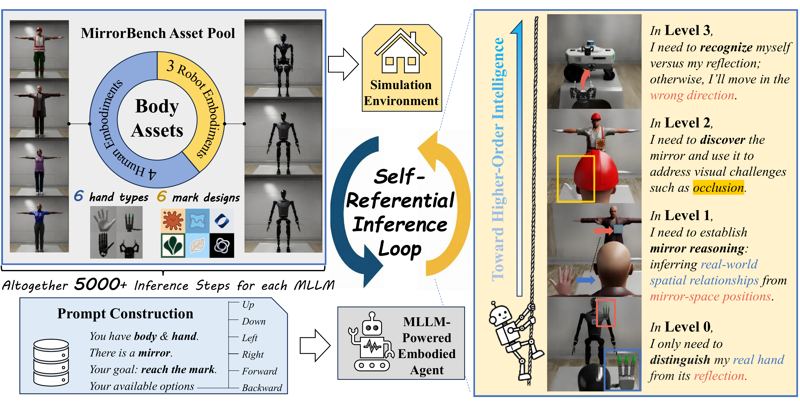

# MirrorBench: Evaluating Self-centric Intelligence in MLLMs by Introducing a Mirror

<p align="center">
   <a href="https://fflahm.github.io/mirror-bench-page/" target="_blank">🌐 Project Page</a> | <a href="https://huggingface.co/datasets/flahm/MirrorBenchAssets" target="_blank">🤗 Data</a> | <a href="#" target="_blank">📃 Paper(TBD) </a>
</p>

<div style="width: 100%; text-align: center; margin:auto;">
    
</div>

## Installation

### Setup Simulation
Download and unzip NVIDIA Isaac Sim 4.5.0 (Standalone) from the official download page, choosing the link corresponding to your operating system:
https://docs.isaacsim.omniverse.nvidia.com/4.5.0/installation/download.html.

Then set the environment variable `ISAACSIM_ROOT`, for example: `set ISAACSIM_ROOT= "D:\isaac-sim-4.5.0"` (Windows) or `export ISAACSIM_ROOT=/home/user/isaac-sim-4.5.0` (Linux).

### Install Dependencies
Run:
```shell
# Windows
%ISAACSIM_ROOT%\python.bat -m pip install openai==1.79.0

# Linux
$ISAACSIM_ROOT/python.sh -m pip install openai==1.79.0
```

### Download Assets
Run:
```shell
pip install huggingface_hub
python download.py
```
The necessary assets will be downloaded to the `assets` directory.

## Evaluation

TODOs: API; Other agent types: opensource, human, random; Args; Results

### Single Scenario
You may familiarize yourself with a single inference scenario in **MirrorBench** by running commands like:
```shell
# Windows
%ISAACSIM_ROOT%\python.bat  inference.py --body male_0 --hand mano_white --mark splash --level 1 --model gpt-4o

# Linux
$ISAACSIM_ROOT/python.sh  inference.py --body male_0 --hand mano_white --mark splash --level 1 --model gpt-4o
```

### Full Evaluation
We also provide scripts for full evaluation with over 5,000 inference steps per MLLM. To use them, run:
```shell
# Windows
evaluate.bat MODEL_NAME

# Linux
./evaluate.sh MODEL_NAME
```

## Citation

If you find our work interesting, please feel free to cite our paper:

```bibtex

```